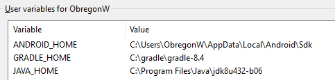
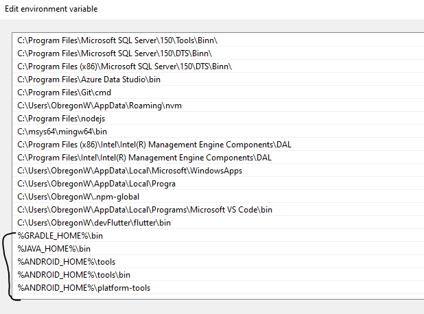

# Instalaccion de cordova  

- Me cree el proyecto con 
  `ionic start dev-cordova --cordova`  

- Generar el proyecto en versión web, me devuelve por defecto el archivo www.  
  `ionic build`  

- En caso no se tenga cordova instalado usamos este comando.  
  `npm install -g cordova`  

- Instalamos el JDK y SDK  en las variables  
  
 
Y en la variable path colocamos estas instalaciones  

- Agregamos la plataforma de android, al mismo tiempo me crea el resources y el config.xml. 
  `ionic cordova platform add android`  

- Construimos el proyecto  
  ` cordova build android`  

- El aplicativo se encuentrra en platforms\android\app\build\outputs\apk\debug\app-debug.apk

